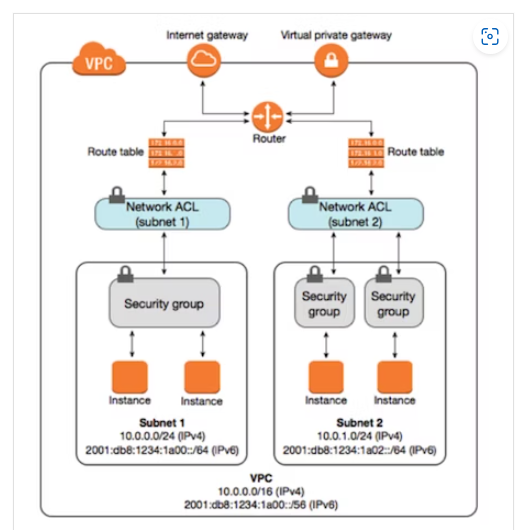

### 問3

EC2への外部からのトラフィック通信を制御するためのサービス  

|セキュリティグループ|ネットワークACL|
|-|-|
|サーバ（EC2）単位|サブネット単位|
|インバウンドを設定すればアウトバウンドも許可される|インバウンドを設定すればアウトバウンドも許可されない|
|許可のみを設定|許可と拒否を設定|
|デフォルトで同じSG内通信のみ許可|デフォルトですべての通信を許可|

### 問5

移行関連のAWSサービス  

- AWS Application Discovery Service  
  オンプレミスの情報を収集して、移行計画の準備を支援するサービス  
- AWS Schema Conversion Tool  
  データベース移行時に色々自動で変換してくれるスタンドアローンアプリケーション  
- AWS Database Migration Service  
  安全にAWSへのデータべ――ス移行できる  
- AWS Application Migration Service(AWS MGN)  
  オンプレのサーバをAWSへ移行するサービス  
- CloudEndure  
  AWS MGNと基本的には同じ。違いはマネジメントコンソールでの操作が可能なこと  
  手順が少なくて済む  

- AWS Miguration Hub  
  各移行ツールの実行状況を見れるダッシュボードサービス  
- AWS Snow Family  
  データ移行のための機械をPCに接続し、AWSにデータ移行できるデバイス  
  Snowball、Snowball edge、Snowmobileがある。  
- AWS DataSync  
  オンプレのストレージとS3 or EFSのデータ転送を自動化するサービス  
- AWS Transfer Family  
  SFTP、FTP及びFTPSに対応したデータ転送サービス  
  S3を利用する  
- AWS Outposts  
  自社の環境にサーバがあるように扱えるハイブリッド環境を提供  
